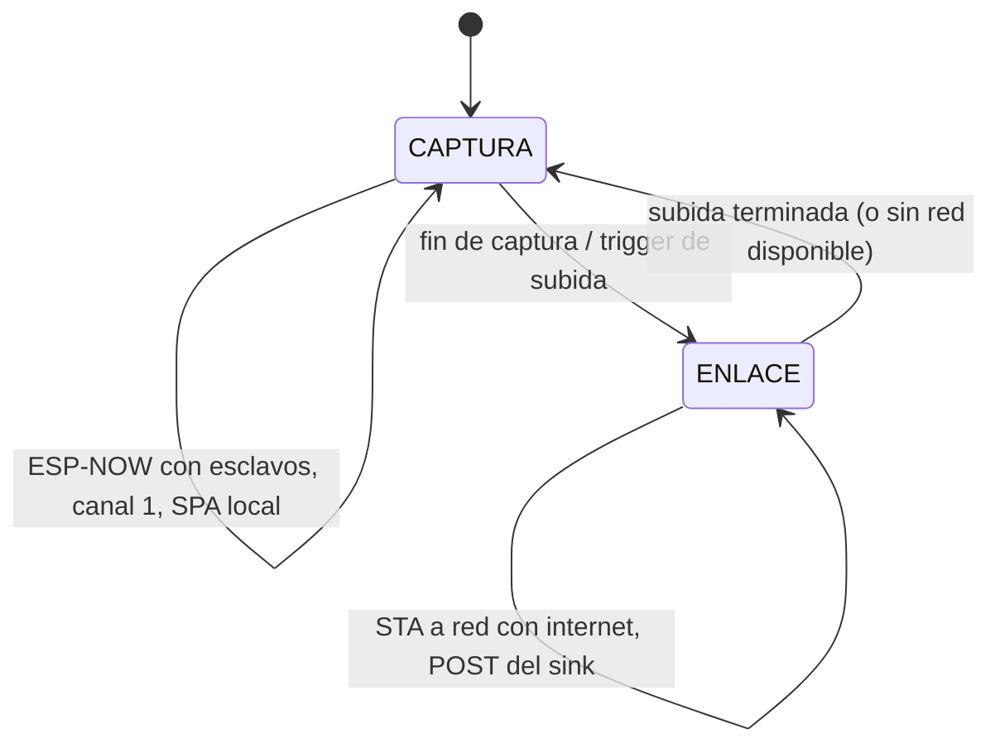

# Plan: modo ENLACE del maestro + sink de datos automático

Estado: **planificación**, sin implementar. Sirve como resumen de lo discutido
para retomar en otra sesión, cuando haya hardware disponible para probar.

## Motivación

Hoy el flujo de campo es: el maestro ESP32 levanta un AP local (`GeoNetwork`,
`192.168.4.1`) sin salida a internet, el operador se conecta con el celular o
la notebook, revisa la captura en la SPA, y al final descarga un ZIP armado
100% en el navegador (`data/js/zip_store.js` + `export.js` en
`firmware/esp32/Nodo comunicación/master/data/`). Ese ZIP se descomprime a
mano en una carpeta que después lee `review_field_data.py`.

Problema: mientras el celular está conectado al AP del maestro, Android le
corta (o desprioriza) los datos móviles, porque asume que una red WiFi debe
tener salida a internet. Esto bloquea cualquier idea de subir datos en vivo o
dejar mediciones corriendo solas de noche con sync automático.

Objetivo final: que el maestro pueda, sin intervención manual, mandar los
datos de una sesión de mediciones a un servidor propio (la PC del usuario) vía
una VPN, y de ahí a una carpeta de Google Drive — sin eliminar la ruta manual
del ZIP, que sigue existiendo como hoy.

## Decisión de arquitectura para el enlace de red: multiplexación temporal

Se evaluaron tres opciones para que el maestro tenga salida a internet sin
romper el ESP-NOW con los esclavos:

1. **Celular como hotspot, maestro como STA** — resuelve el problema de
   Android, pero dado que el AP y la STA del ESP32 comparten la misma radio
   y el mismo canal (en `WIFI_AP_STA` el AP queda forzado al canal de la
   STA), esto por sí solo no permite mantener el AP en canal 1 para ESP-NOW
   mientras la STA está asociada al hotspot en otro canal.
2. **Maestro repetidor con NAT** (AP + STA concurrentes, mismo canal,
   `esp_netif_napt_enable`) — técnicamente posible y sin ventanas muertas,
   pero requiere que la red upstream esté fijada a canal 1 (viable con un
   router de casa, configurando el canal a mano). **Se descarta como
   solución principal**: en campo el escenario típico es una zona aislada,
   sin ningún router disponible, solo el celular del operador — y los
   celulares no dejan fijar el canal del hotspot. Además reintroduce
   interferencia RF durante la captura, algo que el firmware ya evita a
   propósito (`AP_KEEP_BEACON_DURING_CAPTURE`, pausa de beacon).
3. **Multiplexación temporal (elegida)** — el maestro nunca está en las dos
   redes a la vez; alterna entre dos fases:
   - **`CAPTURA`**: modo actual sin cambios — `WIFI_AP_STA`, AP propio en
     canal 1, ESP-NOW activo con los esclavos, SPA local disponible.
   - **`ENLACE`**: el maestro se desconecta de ese rol y se asocia como STA
     a lo que haya disponible con salida a internet (el hotspot del
     celular en campo, el WiFi de casa de noche), sin depender de ningún
     canal fijo del otro lado.

   Esto es seguro porque el protocolo con los esclavos es **maestro-iniciado**
   (los esclavos esperan pasivos una consulta, no hacen polling ni
   retransmiten solos) y los esclavos **no escanean canales**: tienen
   hardcodeado `esp_wifi_set_channel(1, ...)` en
   `slave/src/main.cpp:3062`, así que apenas el maestro vuelve a subir su AP
   en canal 1, el ESP-NOW retoma sin ninguna negociación. La única regla
   dura de diseño es **no cambiar de fase a mitad de una captura**.

### Validación hecha hasta ahora

Se armó y se envió al usuario un sketch standalone descartable (no toca el
firmware real) que conecta un ESP32 como STA al hotspot del celular y sirve
`"OK"` en `/`, para confirmar en la práctica que el celular mantiene datos
móviles mientras el ESP está asociado a su hotspot. **Pendiente: correr esta
prueba en campo/con hardware y confirmar resultado antes de tocar
`main.cpp` del maestro.**

## Fase 1 — Firmware del maestro (`firmware/esp32/Nodo comunicación/master`)

- Agregar el estado `ENLACE` a la máquina de estados existente en
  `src/main.cpp`.
- Definir qué dispara la transición `CAPTURA → ENLACE`: ¿después de cada
  captura individual, cada N capturas, o por temporizador? (a decidir)
- **Buffering pendiente de diseñar**: hoy el maestro no persiste mediciones
  localmente (LittleFS solo aloja la SPA; los datos se espejan en vivo por
  WebSocket al navegador y el navegador los acumula en `data_store.js`). Sin
  navegador conectado de noche, el maestro mismo tiene que retener los datos
  en RAM hasta la fase `ENLACE`. Hay que confirmar cuánta RAM/PSRAM libre
  hay en la placa real y si alcanza para varias capturas, o si conviene
  subir después de cada captura individual en vez de acumular toda la
  noche.
- Definir el protocolo del envío en `ENLACE` (ver Fase 2): ¿reusar el
  protocolo binario 0x56 que ya se usa con MATLAB (`matlab_transport.h`), o
  uno nuevo simplificado para HTTP POST?
- Mantener sin cambios: SPA local, ruta de exportación manual del ZIP,
  ESP-NOW, protocolo con MATLAB.

## Fase 2 — Servidor sink en `software/python`

- Nuevo servicio (ubicación sugerida: junto a `geophone_scope/`, ya tiene
  `protocol.py` para parsear el protocolo binario existente) que escucha
  peticiones del maestro durante `ENLACE` y escribe los datos a disco.
- **Decisión pendiente**: ¿quién arma la estructura de carpetas
  (`maestro/`, `<tipo>_<pcb_id>/raw_f32le.bin`, `filt_f32le.bin`, CSVs,
  `captures/NNN_.../metadata.json`, `combined/*.csv`) que hoy arma
  `export.js`/`zip_store.js` en el navegador? Recomendación: que la arme el
  servidor Python (reusando/replicando lógica en vez de duplicarla en
  C++ dentro del firmware, que ya está bastante cargado). El maestro manda
  los paquetes "en crudo" y el sink hace el trabajo de estructurarlos.
- El sink escribe en el mismo layout de carpetas que ya consume
  `discover_dataset` (`field_review_data.py:184`), para que
  `review_field_data.py` no necesite ningún cambio de lógica.

## Fase 3 — Transporte / VPN (Tailscale)

Punto que hay que resolver con cuidado, no es tan directo como "conectar el
ESP a la VPN":

- **El ESP32 no puede correr el cliente de Tailscale** (es un binario Go
  pensado para sistemas operativos completos, no para un microcontrolador).
  Para que un dispositivo hable con una IP de Tailscale (rango `100.x.y.z`)
  tiene que ser miembro del tailnet — y el ESP32 no puede serlo.
- **Recomendación**: usar **Tailscale Funnel** (o `tailscale serve`) del
  lado de la PC. Funnel expone el servicio del sink por HTTPS público
  normal (con TLS válido, sin abrir puertos en el router, sin IP fija). El
  maestro entonces hace un POST HTTPS común a esa URL pública — no necesita
  ningún cliente VPN ni certificados propios. "La VPN" queda como la forma
  en que vos protegés/administrás el acceso a tu PC, no como algo que el
  firmware tiene que implementar.
- Alternativa descartada por frágil: correr un subnet router de Tailscale
  en el celular para meter la red del hotspot al tailnet — depende de la
  red de cada operador en cada salida de campo, no escala.
- A confirmar: si tu PC no está siempre prendida/con Tailscale corriendo,
  las subidas nocturnas fallarían — decidir si el sink vive en tu PC o en
  algo que esté siempre encendido (ej. una Raspberry Pi, un VPS chico).

## Fase 4 — Entrega a Google Drive

- **Recomendación simple**: que el servidor Python escriba directo en la
  carpeta local que sincroniza *Google Drive para escritorio* (Drive for
  desktop). Sin API de Drive, sin OAuth, sin tokens — Drive sincroniza solo
  lo que aparece en esa carpeta.
- Alternativa (API de Drive): más robusta si el sink corriera en una
  máquina sin Drive Desktop montado (ej. un servidor headless), pero suma
  credenciales y mantenimiento. Solo si hace falta.

## Fase 5 — `review_field_data.py`

- No requiere cambios de lógica. Ya descubre datasets con `discover_dataset`
  a partir de cualquier `--raw-root` con esa estructura de carpetas
  (`review_field_data.py:184` en `field_review_data.py`).
- Alcanza con apuntar `--raw-root` a la carpeta que deja el sink (o la
  carpeta sincronizada de Drive), o cambiar el default
  (`DEFAULT_RAW_ROOT`, hoy `data/raw/Canchita`) si se quiere que sea el
  nuevo default.

## Qué NO cambia

- La ruta manual de exportar el ZIP desde la SPA sigue existiendo tal cual
  — el sink es un canal adicional, no un reemplazo.
- El protocolo maestro↔esclavos (ESP-NOW) y maestro↔MATLAB (USB) no se
  tocan.

## Preguntas abiertas para la próxima sesión (con hardware)

1. ¿Confirma la prueba de campo que el celular mantiene datos móviles con
   el ESP asociado a su hotspot?
2. ¿Cuánta RAM/PSRAM libre hay en la placa real del maestro para bufferear
   capturas durante `CAPTURA` antes de la fase `ENLACE`?
3. ¿Trigger de `ENLACE`: por captura, cada N capturas, o por temporizador?
4. ¿Protocolo del POST maestro→sink: reusar el binario 0x56 existente o uno
   nuevo?
5. ¿Tailscale Funnel accesible de forma estable desde la red donde esté tu
   PC (o conviene un servidor siempre encendido en vez de tu PC)?
6. ¿Sink escribe directo a la carpeta de Drive Desktop, o hace falta la API
   de Drive?
